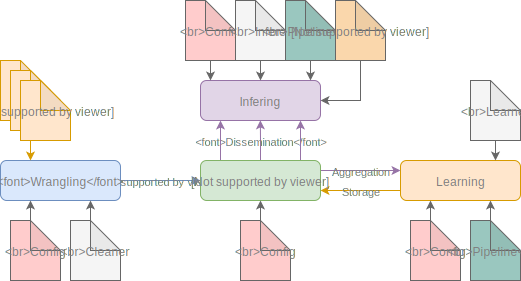
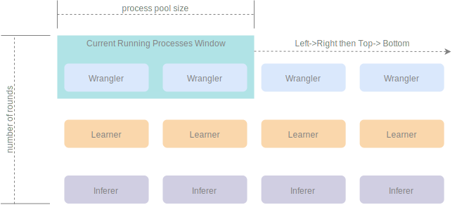
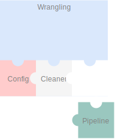
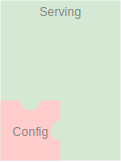
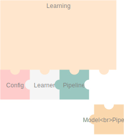
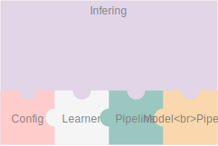

.. |files-only| replace:: :ref:`section_files-only`
.. |all-options| replace:: :ref:`section_all-options`
.. |automated| replace:: :ref:`section_automated`
.. |mongo| replace:: :ref:`section_mongo`

.. _mongodb: https://www.mongodb.com/
.. |mongodb| replace:: MongoDB

.. _pymongo: https://api.mongodb.com/python/current/
.. |pymongo| replace:: PyMongo

.. _page_overview:

Overview
========

.. note::

    Throughout this overview and in certain other sections the examples provided are for |files-only| installations, however this is only to make it easier to use the inbuilt examples/ sample files rather than having to force the user to define his/ her own cleaning, learning, infering scripts, for the sake of simplicity.

    If you are not using the |files-only| installation you will have to point nemesyst to cleaners, learners, predictors etc that you want to use. Although even if you are using |files-only|, eventually once you have better understood and tested Nemesyst then you should likeley move to creating your own ones that you require, and using a normal installation of Nemesyst such as one of the |automated| examples.

.. _section_nemesyst-literal:

Nemesyst literal un-abstract stages
***********************************

.. figure:: nemesyst_example.svg
    :alt: Nemesyst use-case example diagram.
    :figclass: align-center

    This image is a use case example of Nemesyst applied to a distributed refrigeration fleet over multiple sites, and both online and offline learning capabilities occuring simultaneously.

Nemesyst has been made to be generic enough to handle many possible configurations, but we cannot possibly handle all possible scenarios. Sometimes it may be necessary to manually configure certain aspects of the process, especially regarding MongoDB as it is quite a well developed, mature, database, with more features than we could, and should automate.

.. _section_nemesyst-abstraction:

Nemesyst Abstraction of stages
******************************

    Nemesyst has abstracted, grouped, and formalised what we believe are the core stages of applying deep learning at all scales.

Deep learning can be said to include 3 stages, data-wrangling, test-training, and inferring. Nemesyst adds an extra layer we call serving, which is the stage at which databases are involved as the message passing interface (MPI), and generator, between the layers, machines, and algorithms, along with being the data, and model storage mechanism.

.. _section_nemesyst-parallelisation:

Nemesyst Parallelisation
************************

As of: `2.0.1.r6.f9f92c3 <https://github.com/DreamingRaven/nemesyst/commit/f9f92c38c900a0f0bb87e9133aa5b9bb48d60b41>`_

    Nemesyst parallelises each script, up the the maximum number of processes in the process pool.

Local parallelization of your scripts occur using pythons process pools from multiprocessing. This diagram shows how the rounds of processing are abstracted and the order of them. Rounds do not continue between stages, I.E if there is a spare process but not enough scripts from that stage (e.g cleaning) it will not fill this with a script process from the next stage (e.g learning). This is to prevent the scenario where a learning script may depend on the output of a previous cleaning script.

.. _section_wrangling:

Wrangling / cleaning
********************

See |all-options| for a full list of options.

    Wrangling is the stage where the data is cleaned into single atomic examples to be imported to the database.

.. :|files-only| example\::
..
..   .. literalinclude:: ../../tests/cleaning.sh

.. _section_serving:

Serving
*******

See |all-options| for a full list of options.

    Serving is the stage where the data and eventually trained models will be stored and passed to other processess potentially on other machines.

Nemesyst uses |mongodb| databases through |pymongo|_ as a data store, and distribution mechanism. The database(s) are some of the most important aspects of the chain of processes, as nothing can operate without a properly functioning database. As such we have attempted to simplify operations on both the user scripts side and our side by abstracting the slightly raw |pymongo|_ interface into a much friendlier class of operations called |mongo|.

A |mongo| object is automatically passed into every one of your desired scripts entry points, so that you can also easily operate on the database if you so choose although aside from our data generator we handle the majority of use cases before it reaches your scripts.

.. :|automated| example\::
..
..   .. literalinclude:: ../../tests/serving.sh

.. note::

  Please see :ref:`page_serving` for more in depth serving with Nemesyst

.. _section_learning:

Learning
********

See |all-options| for a full list of options.

    Learning is the stage where the data is used to train new models or to update an existing model already in the database.

.. :|files-only| example\::
..
..   .. literalinclude:: ../../tests/learning.sh

.. warning::
  Special attention should be paid to the size of the resultant neural networks. Beyond a certain size it will be necessary to store them as GridFS objects. The basic GridFS functionality is included in nemesyst's :ref:`section_mongo` however this is still experimental and should not be depended upon at this time.

.. _section_inferring:

Inferring / predicting
**********************

As of: `2.0.2.r7.1cf3eab <https://github.com/DreamingRaven/nemesyst/commit/1cf3eab0dd6196c9065f43e9b231a50687f67065>`_

See |all-options| for a full list of options.

    Inferring is the stage where the model(s) are used to predict on newly provided data.

.. :|files-only| example\::
..
..   .. literalinclude:: ../../tests/learning.sh
